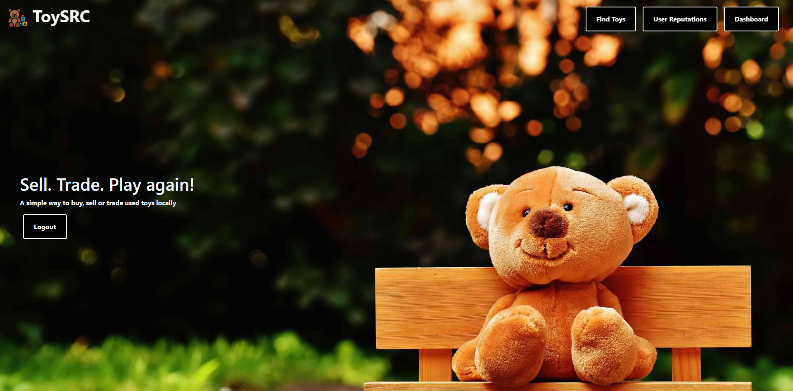
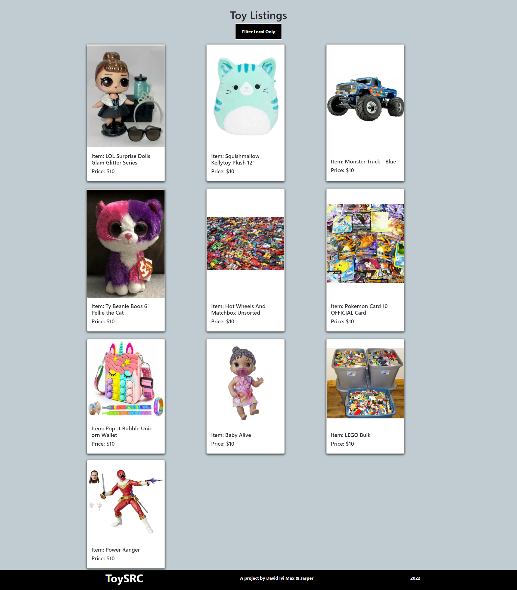
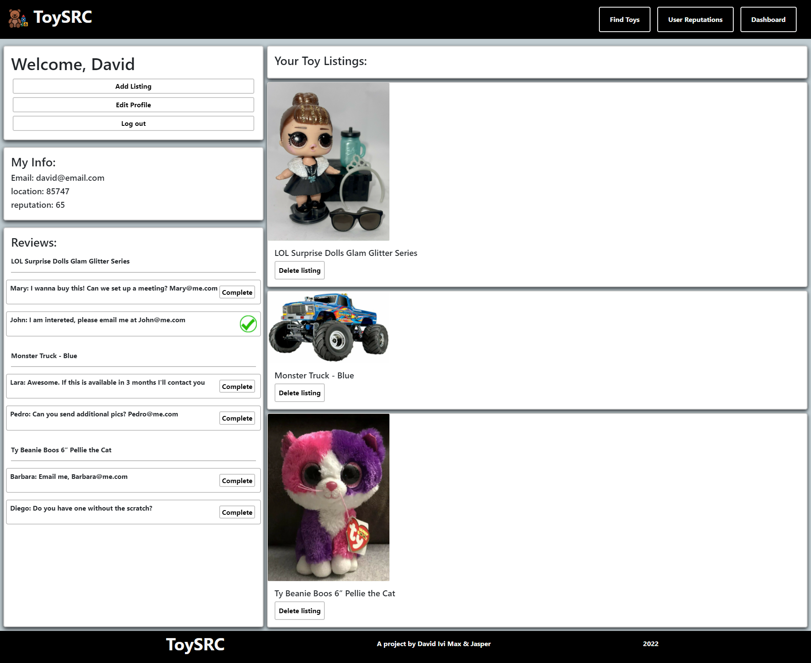
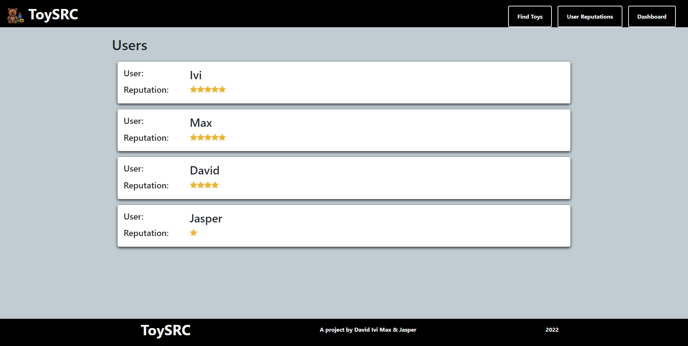
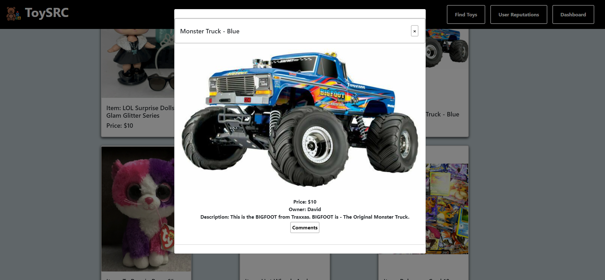
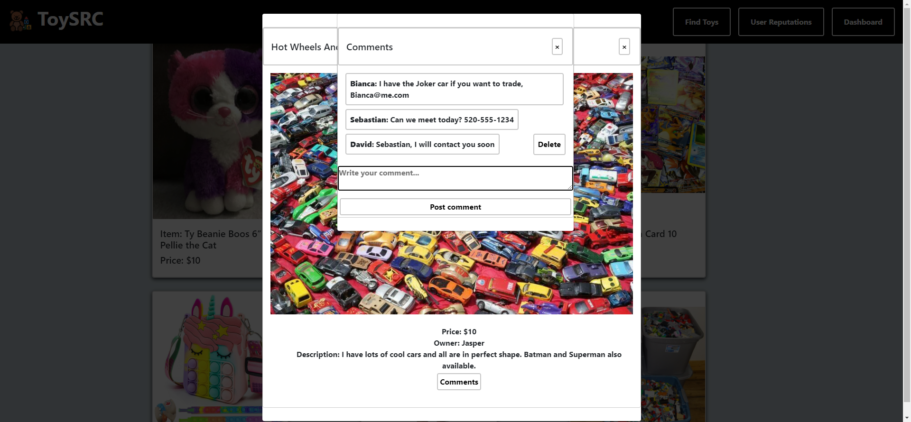

# ToySRC

## Description
Toy trading website where users can sign up and buy/sell toys with other users

## Table of Contents

- [Links](#links)
- [Installation](#installation)
- [Usage](#usage)
- [License](#license)
- [Contributing](#contributing)
- [Tests](#tests)
- [Credits](#Credits)

 ## Links
https://github.com/jasperoudemans/toy-src

https://toy-src.fly.dev/

https://toy-src.herokuapp.com/

Screenshot1:


Screenshot2:


Screenshot3:


Screenshot4:


Screenshot5:


Screenshot6:


 ## Installation
To install necessary dependencies, run the following command:

```
npm run install
```

 ## Usage
Please ensure both client and server side dependencies are installed

 ## License
This project is not licensed

 ## Contributing
Please contact us if you wish to contribute

 ## Tests
To run tests, run the following command:

```
There are currently no tests
```

 ## Credits
David Schepis [Github](https://github.com/davidschepis) [Email](davids.developer@outlook.com)

Ivi Barros [Github](https://github.com/ibarros19) [Email](ivibarros19@gmail.com)

Jasper Oudemans [Github](https://github.com/jasperoudemans) [Email](jasperoudemans@gmail.com)

Max Wittner [Github](https://github.com/lilslash) [Email](davids.developer@outlook.com)
